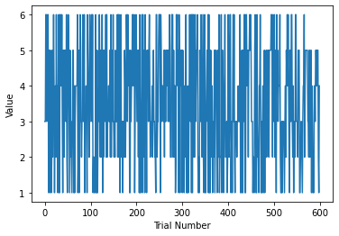

# Follow up notes for week 1.

## Some terms.

It is very useful be totally comfortable with some terms that are
commonly used to describe measurements.

| True value |  The real value of the thing we are try to measure.
May or may not be known, depending on the context. |
| Accuracy | How close we come to measuring the true value |
| Bias | Measuring a value that is different from the true value |
| Uncertainty | The range in which we think the true value
"probably" lies. |
| Precision | How small our uncertainty is, irrespective of how
accurate it is. |

So, a highly accurate measurement has very little bias.  A highly
precise measurement has very small uncertainty.  A "good" measurement is
both accurate and precise.

### Statistical versus systematic errors, standard error versus standard deviations 

Last week we gave you a number of measurement of the Hubble constant
and asked some questions and had you compute some statistical
measurements.

The data looked like this:

When asked to estimate the uncertainty of the Hubble parameter, many
of you gave numbers from $3 -- 6 Km s^{-1} Mpc^{-1}$.  However, the
standard deviation of that distribution was 2.73 and the standard
error 0.44.

Many of you have learned that the standard error gives the uncertainty
on a value if you have multiple measurements.  But clearly 0.44 is a
pretty optimistic estimate of the uncertainty of our knowledge of the
Hubble constant.

So, what is going on?

1.  First off, when we define the uncertainty, we typically used a
    convention that means something like "there is a 68% chance that
    the true value lies in the range that covered by the stated
    uncertainty.  So, we actually expect 32% of the values to lie
    outside the error bars.  So the error bars don't have to cover all
    the values.

2.  The standard error is basically, "how much you would expect the
    mean of your measurement to change by, if you kept measuring
    things in an ideal world where all of the uncertainties were
    purely statistical", (or, if you prefer, "how much the mean would
    change if you kept drawing your measurements from exactly the same
    distribution)."  This doesn't questions about systematic biases
    in your measurements, (or, if you prefer, if the distribution you
    are drawing from is actually centered on the true value).  It is a
    question of precision versus accuracy.

So, in our case, the standard error tells us that we keep making the
same types of measurements, the mean is probably not going to change
all that much.  But the shape of the distribution suggest that some of
our measurements might not agree with others, so we should probably
account for some systematic effects in assigning the uncertainties.
With not additional information it would be perfectly reasonable to
use the standard deviation as an estimate of those systematic uncertainties.

### Comment on lab reports.

Overall we were happy with the lab reports.  There were just a
couple things we wanted to point out.

When things didn't quite add up, there was some tendency to write down what you
thought was the desired answer rather that reasoning out some of the
issues and pointing out the problems.

An good example of this came in the answers to question 2.1.  When
asked what we can learn from this figure: 

Many people said things to the effect that "We can see that each outcome
is occurring equally often."  While I agree that the plot looks like
quite random, I think it is actually pretty hard to get information
about how often each value is occurring.  That why a histogram is
better.

Similarly, when asked which statistic is the best to estimate the true
value of the Hubble constant (question 8.1) many people gave one word
answers, which is fine b/c you were just being asked for your opinion,
however, a more interesting answer is probably more like "it depends
on ...", or "in this case either mean or median, because ...".

I will try and give you more of an indication of when a short answer
is appropriate, and when it might make sense to provide a longer
answer and state your reasoning.

