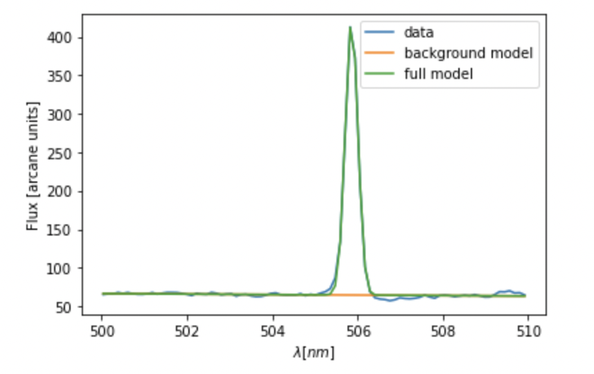
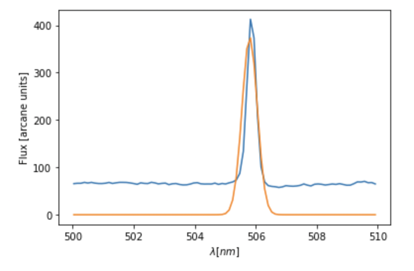
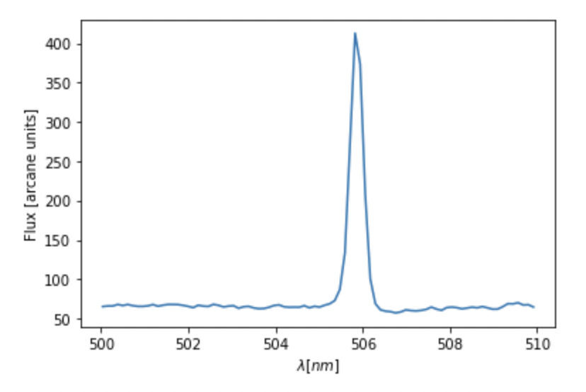

# Follow up notes for week 6..

### Correlations between model parameters and fitting with minimizers.

Two weeks ago, we learned how the `chi**2` could be used as a metric for the level of agreement between a model and data.

Last week, we learned a few ways that using this `chi**2` may return less-than-ideal results. If parameters aren't chosen in a thoughtful way, then you may end up with correlated parameters, where after changing one, you must also change another to locally minimize the `chi**2`.

Moreover, we learned about some fitter idiosyncrasies. For example, if a reasonable number of parameters are chosen, and initial values are chosen close enough to the desired ones, then fitters can do a very nice job matching model to data:

However, we can also under-model our data if we don't include as many parameters as are justified on physical/theoretical grounds. This may or may not give a decent fit for some subsets of the data, but doesn't do a great job at fitting all of the data:

Note: we can also "over-fit" data, where we provide many more many parameters than are justified on physical/theoretical grounds. This will make our data match our model nicely, but more often than not makes the predictive power of the model much worse!

The last idiosyncrasy we learned about was the fitter's ability to either not converge, or converge on values very far from what we expect it to. This usually occurs if we don't provide reasonable starting values for our fit function:

One good rule of thumb with fitting: always make sure to visually check how good your fit is - don't just rely on the magic of the minimizer and assume your fit will come out with sensible parameter values!