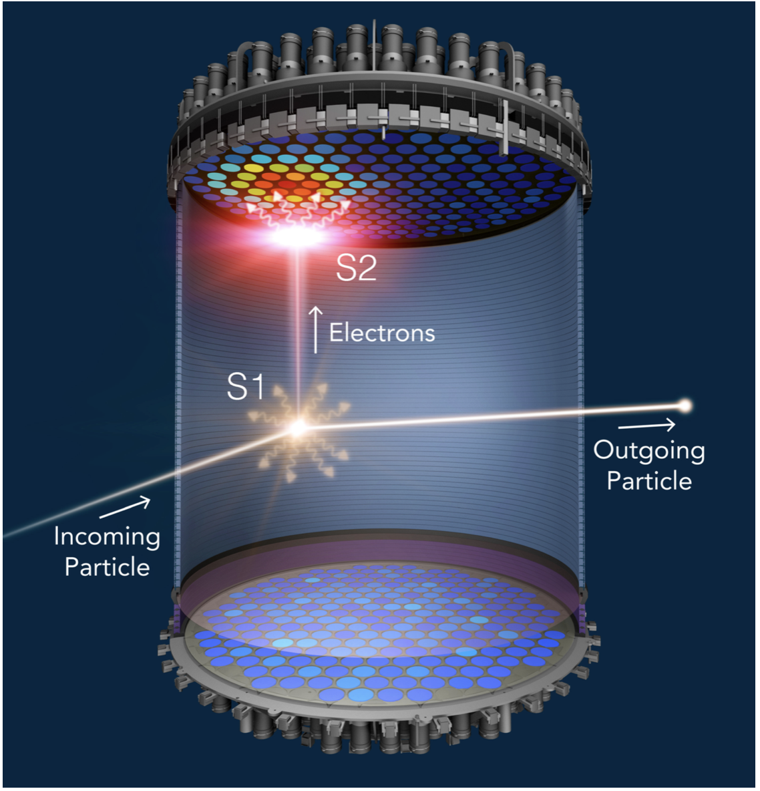
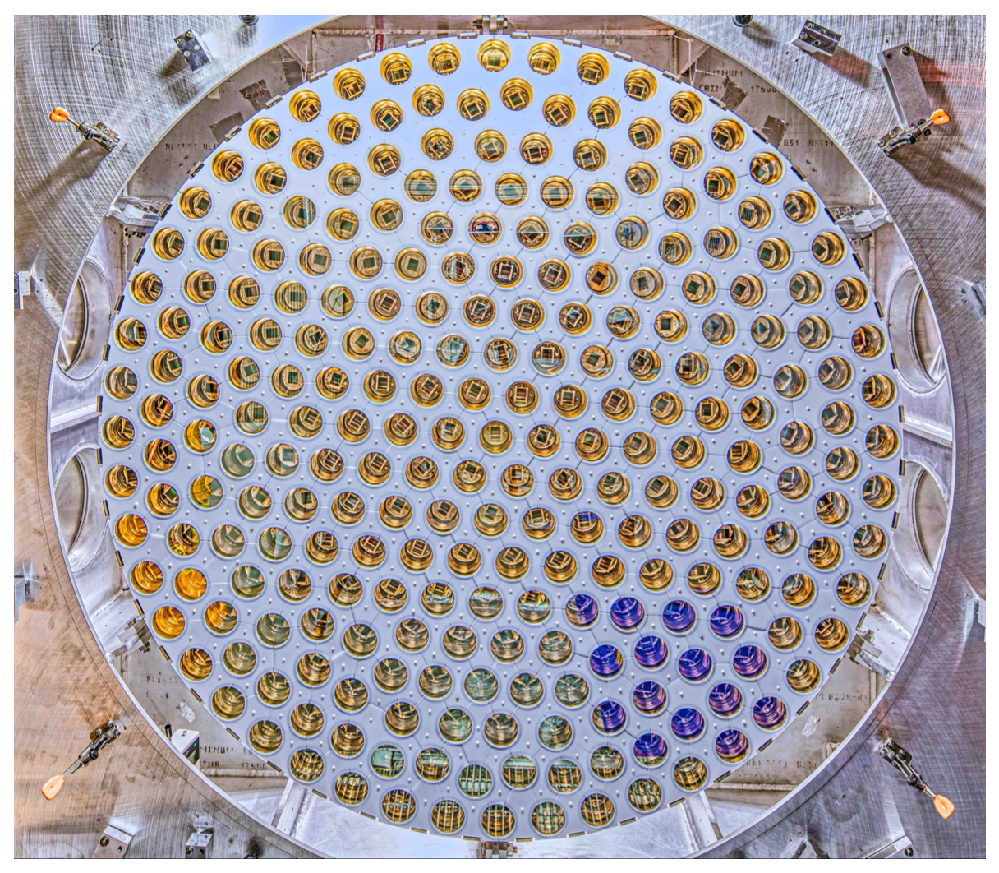

# Notes and materials for Week 7

Topics covered: Data selection, efficiency, leakage, and rare event searches

* Announcements and information
  * Follow up from week 6 Lab.  Comments [here](Week6_after.md)

* Course material
  * [Data analysis topics](#Data%20analysis%20topics)
  * [Scientific context](#Scientific%20context%20and%20resources)
  * [Python functions and tools reference](#Python%20functions%20reference)
  * [Template for "report" questions]()

## Data analysis topics

### Data selection, efficiency, and leakage in the context of dark matter (rare event) searches

This week we're going to study techniques for selecting data of interest from a larger dataset. Oftentimes, experiments searching for particular signals need a way to sift through less interesting (a.k.a. background) data in order to see their desired signal. This is particularly important for sensitive experiments looking for rare events, where the background is dominant over any new physics.

To sensibly reduce data to see rarer and more interesting signals, we use two concepts: signal acceptance and background leakage. The former tells us how the "interesting" data is affected by our data reduction, and the latter tells us how the "less interesting" data is affected by our data reduction. Both are necessary to properly do a search for rare signals.

Diagram of data selection

## Scientific context and resources

In these two notebooks, we'll be studying a simple example of how a dark matter direct detection search works.

Dark matter is a type of matter that comprises about 85 percent of the matter density of the universe, but whose properties are still relatively unknown to us. There are a few different ways we can try to understand these properties. One of these is called "direct detection," where we wait for dark matter particles to bump into very sensitive detectors and leave a signal. The LUX-ZEPLIN (LZ) experiment is one such detector. It uses a tub filled with liquid xenon to look for scatters of dark matter on xenon atoms:

When particles scatter off of xenon atoms, they produce two signals: an initial burst of light (an S1), and a secondary burst of light (S2), created from electrons freed in the initial interaction. This light is detected by arrays of photomultiplier tubes (PMTs) in the top and bottom of the detector:

The S1 and S2 signal structures look slightly different, which helps us identify them (signals shown below - S1 is green, S2 is blue).

Different types of interactions can create different sizes of S2, however. Dark matter scatters will generally produce less S2 light for a similar recoil energy than a background gamma ray or beta ray. Having tools to suppress background, and equally important, discriminate background from our desired dark matter signal, allows us to mount ever more-sensitive searches for dark matter.

The LZ experiment will be turning on very soon, so stay tuned for word on our search!

## Python functions reference

We will not be using any new python functions this week. 

| Function Name            | What it does |
| - | - |

<!--  LocalWords:  
 -->
<!--  LocalWords:  
 -->
