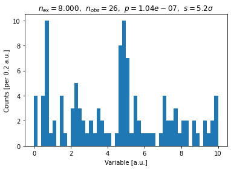
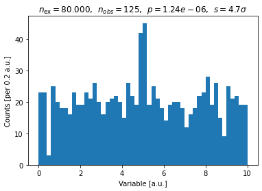
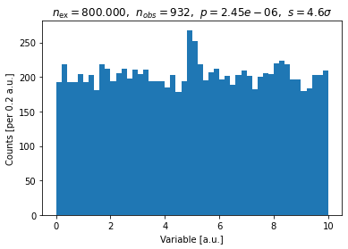
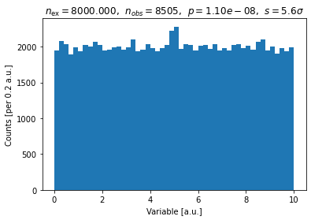
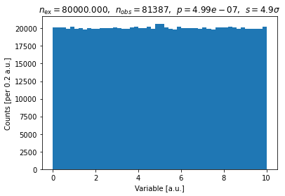

# Follow up notes for week 7..

### Optimizing a search strategy.

Last week, we "searched" for Dark Matter in some simulated data.  One thing that we found
is that the best search strategy depended our our expectation of the signal and background levels.

That was because while we could account for some background in our model, we had to worry about the
expected statistical fluctuations in the background.  Since we were just counting events, the
expected statistical fluctuations were about equal to the square root of the number of background events.

So, what we ended up caring about was essential the ratio of the number of signal events passing our cut to the
square root of number of background events.  This is exactly the "signal-to-noise" ratio that you
have probably heard mentioned in other concepts.

To help you lock down the idea that what constitutes a "significant" signal depends on the background,
here are five simulations of a signal peak sitting above a flat background.  Each example has a significance
of around 5 sigma, but because of the different background levels, they all look very different.

<!--  LocalWords:  bkg_10.png bkg_100.png bkg_1000.png bkg_10000.png
 -->
<!--  LocalWords:  bkg_100000.png
 -->
