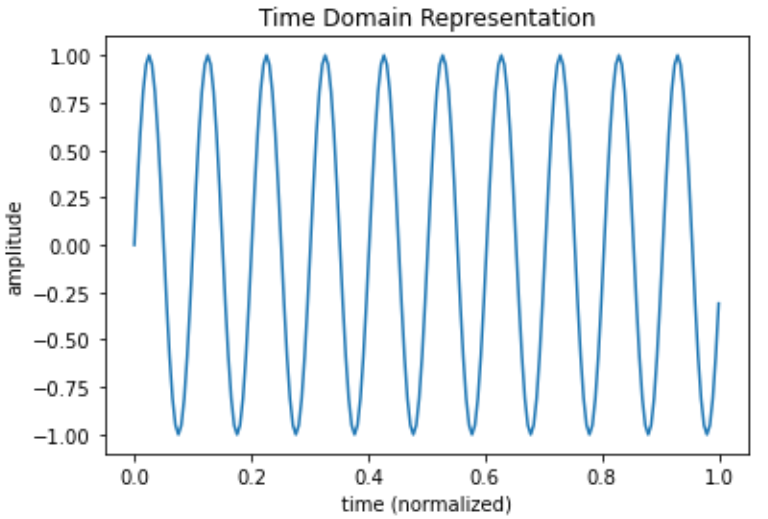

# Notes and materials for Week 8

Topics covered: Fourier Transform and frequency space, frequency filtering, 2D Fourier methods, Background subtraction for noise reduction and signal amplification. 

* Course material
  * [Class Slides](https://docs.google.com/presentation/d/1qtrlylFrjuZ-4gW7CGqLBHZMTaFwV9tr8LRbnJbtHls/edit?usp=drive_link)
  * [Data analysis topics](#Data%20analysis%20topics)
  * [Scientific context](#Scientific%20context%20and%20resources)
  * [Python functions reference](#Python%20functions%20reference)
  * [Template for "report" questions](https://docs.google.com/document/d/1va2FBr_smgAQoA3sfFUr-7YVUBoQgQdOOOrBtR7fD_M/edit?usp=drive_link)

## Data analysis topics

### Fourier Transforms for studying periodic structures in 1D and 2D

This week we're going to explore a powerful and highly applicable tool for data visualization that is naturally suited to displaying a dataset's frequency components, or equivalently the "wave-like" features that make up the data. You may recall from previous courses that trigonometric functions are used to represent waves with a single frequency; an example of such a waveform is shown below.

The **period** of this wave is defined as the time it takes for the wave to complete one full oscillation or "cycle," for example the time from peak-to-peak. The **frequency** is then defined as the number of cycles the wave travels per second, and you can count the cycles in the wave above to conclude that the period is T = 0.1 sec and the frequency is f = 10 sec^-1 or 10 Hz. In general, the frequency and period of a wave are inversely related (f = 1/T) so that lower frequency waves will correspond to broader features of the signal and high frequency waves will related to the sharper features. 

Now it isn't immediately obvious that any signal can be represented as a bunch of waves with varying frequency and amplitude, but this is actually a rigorously established fact of mathematical analysis that given enough sine functions, any shape could be created to arbitrary accuracy. An example of such a representation of a signal is shown below for a square wave, which has sharp edges and is thus difficult to create with curvy sine waves, but can in fact be done with greater accuracy as you keep adding higher and higher frequency terms.

We visualize the frequency composition of a signal using a mathematical object known as a Fourier transform, which converts an arbitrary time-based signal $s(t)$ into an equivalent function of frequency $s(f)$ that carries all the same information as the original function, but represents it in terms of a different variable. This technique is useful for a variety of different datasets, both for visualizing the distribution of frequencies and isolate and filter out noise that may obscure the features we care about. We will also extend these techniques to two dimensions so that we can reveal periodic structures in images that may be difficult to determine by eye. 

## Scientific context and resources

The second notebook for this week will utilize Fourier analysis methods to identify periodic structures in atomic-scale images of electrons on a metal surface. This data was taken using a scanning tunneling microscope (STM) and you can see a simple diagram of the device below. 

The basic principle of operation is that a metallic scanning "tip" is carefully moved across the surface of a material we are interested in. Because the tip is not touching the sample, classically we would not expect any electrons to travel between the tip and sample for the same reason a current can't pass through a wire after you cut it in half. But due to quantum mechanical tunneling, at close enough distances we can measure a miniscule current that directly relates to the number of electrons at that point on the surface. By recording this current and scanning the tip across a region, we can "image" the surface's electronic density and learn important facts about the material's properties. 

Because electrons are extremely small even compared to atoms, the electrons we detect with the STM look like a continuous distribution rather than individual particles. Remarkably, this electron cloud behaves much like a liquid in that any disturbance on the surface creates oscillations in the electronic density just like how throwing rocks in a puddle of water creates waves on the surface. And in the same way that we can learn about properties of water by throwing rocks and studying the waves (for example the surface tension), we can also study these electronic oscillations caused by defects on the surface to measure fundamental characteristics of the electronic energy structure. 

## Python functions reference

We will be using one simple new function to interpolate and subsequently evaluate an empirical/numerical relation. 

| Function Name        | What it does |
| - | - |
| numpy.fft            | NumPy module to compute FFTs and associated frequency bins |
| numpy.fft.rfft       | Compute the 1D Discrete Fourier Transform for real-valued signals (i.e. positive frequencies) |
| numpy.fft.rfftfreq   | Compute the associated DFT frequencies, i.e. each term in the fourier transform |
| scipy.signal         | Extensive module for analysis of continuous (sampled) signals |
| scipy.signal.square  | Function to generate a square wave of amplitude 1 with some duty cycle (default 0.5) |
| scipy.signal.butter  | Generate filter coefficients for a Butterworth type filter |
| scipy.signal.sosfilt | Apply some filter coefficients to a signal |
| scipy.io.wavfile     | Module for handling audio files of .wav format |

